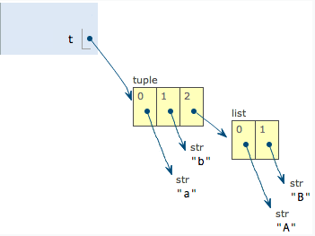

# 数据类型

计算机顾名思义就是可以做数学计算的机器，因此，计算机程序理所当然地可以处理各种数值。但是，计算机能处理的远不止数值，还可以处理文本、图形、音频、视频、网页等各种各样的数据，不同的数据，需要定义不同的数据类型。在 Python 中，能够直接处理的数据类型有以下几种：

## 整数

Python 可以处理任意大小的整数，当然包括负整数，在程序中的表示方法和数学上的写法一模一样，例如：1，100，-8080，0，等等。
计算机由于使用二进制，所以，有时候用十六进制表示整数比较方便，十六进制用 0x 前缀和 0-9，a-f 表示，例如：0xff00，0xa5b4c3d2，等等。
对于很大的数，例如 10000000000，很难数清楚 0 的个数。Python 允许在数字中间以\_分隔，因此，写成 10_000_000_000 和 10000000000 是完全一样的。十六进制数也可以写成 0xa1b2_c3d4。

## 浮点数

浮点数也就是小数，之所以称为浮点数，是因为按照科学记数法表示时，`一个浮点数的小数点位置是可变的`，比如，1.23x109 和 12.3x108 是完全相等的。浮点数可以用数学写法，如 1.23，3.14，-9.01，等等。
但是对于很大或很小的浮点数，就必须用科学计数法表示，把 10 用 e 替代，1.23x109 就是 1.23e9，或者 12.3e8，0.000012 可以写成 1.2e-5，等等。
整数和浮点数在计算机内部存储的方式是不同的，整数运算永远是精确的（除法难道也是精确的？是的！），而浮点数运算则可能会有四舍五入的误差。

### 整数运算永远是精确的？-除法

在 Python 中，有 3 种除法:

- 一种是`/`,它的计算结果是浮点数，即使是两个整数恰好整除，结果也是浮点数。
  ```python
  print(10/3) #输出：3.3333333333333335
  ```
  ```python
  print(9/3) #输出：3.0
  ```
- 一种是`//`,取整。
  ```python
  print(10//3) #输出：3
  ```
- 一种是`%`,取余。
  ```python
  print(10%3) #输出：1
  ```

## 字符串

字符串是以单引号'或双引号"括起来的任意文本，比如'abc'，"xyz"等等。

- 转义字符`\`- 可以转义很多字符，比如`\n`表示换行，`\t`表示制表符，字符`\`本身也要转义，所以`\\`表示的字符就是`\`
  ```python
  print('I\'m "ok"!') # 输出：I'm "ok"!
  ```
  ```python
    print('\\\t\\') # 输出：\       \
  ```
- ''内部的字符不转义`r''`
  ```python
  print(r'\\\t\\') # 输出：\\\t\\
  ```
- 多行内容`'''...'''`
  ```python
  print('''line1
  line2
  line3''')
  ```
  输出：

# 布尔值

在 Python 中，可以直接用 `True`、`False` 表示布尔值（请注意大小写）
布尔值可以用 and(与)、or(或)和 not(非)运算。

# 空值

空值是 Python 里一个特殊的值，用 `None` 表示。None 不能理解为 0，因为 0 是有意义的，而 None 是一个特殊的空值。

此外，Python 还提供了列表、字典等多种数据类型，还可以创建自定义数据类型

# 变量

变量名必须是大小写英文、数字和`_`的组合，且不能用数字开头。

在 Python 中，等号=是赋值语句，可以把任意数据类型赋值给变量，同一个变量可以反复赋值，而且可以是不同类型的变量，例如

```python
a = 123
print(a) # 输出：123
a='ABC'
print(a) # 输出：ABC
a = True
print(a) # 输出：True
a = None
print(a) # 输出：None
```

这种变量本身类型不固定的语言称之为**动态语言**，与之对应的是**静态语言**。静态语言在定义变量时必须指定变量类型，如果赋值的时候类型不匹配，就会报错。

# 字符编码

因为计算机只能处理数字，如果要处理文本，就必须先把文本转换为数字才能处理。最早的计算机在设计时采用`8`个比特（bit）作为一个字节（byte），所以，一个字节能表示的最大的整数就是`255`（二进制 11111111=十进制 255），如果要表示更大的整数，就必须用更多的字节。比如两个字节可以表示的最大整数是`65535`，4 个字节可以表示的最大整数是`4294967295`。

由于计算机是美国人发明的，因此，最早只有 127 个字符被编码到计算机里，也就是大小写英文字母、数字和一些符号，这个编码表被称为`ASCII编码`，比如大写字母 A 的编码是 65，小写字母 z 的编码是 122。

但是要处理中文显然一个字节是不够的，至少需要两个字节，而且还不能和 ASCII 编码冲突，所以，中国制定了`GB2312`编码，用来把中文编进去。

但是全世界有上百种语言，各国制定不同的编码标准，就会出现冲突，导致乱码的问题发生。

因此，`Unicode`字符集应运而生。Unicode 把所有语言都统一到一套编码里，这样就不会再有乱码问题了。

Unicode 标准也在不断发展，但最常用的是 UCS-16 编码，用两个字节表示一个字符（如果要用到非常偏僻的字符，就需要 4 个字节）。**现代操作系统和大多数编程语言都直接支持 Unicode**。

ASCII 编码和 Unicode 编码的区别：**ASCII 编码是 1 个字节，而 Unicode 编码通常是 2 个字节**。

字母`A`用 ASCII 编码是十进制的`65`，二进制的`01000001`；

字符`0`用 ASCII 编码是十进制的`48`，二进制的`00110000`，注意字符'0'和整数 0 是不同的；

汉字`中`已经超出了 ASCII 编码的范围，用 Unicode 编码是十进制的`20013`，二进制的`01001110 00101101`。

把 ASCII 编码的`A`用 Unicode 编码，只需要在前面补 0 就可以，因此，`A`的 Unicode 编码是`00000000 01000001`。

如果统一成 Unicode 编码，乱码问题从此消失了。但是，如果你写的文本基本上全部是英文的话，用 Unicode 编码比 ASCII 编码需要多一倍的存储空间，在存储和传输上就十分不划算。所以又出现了把 Unicode 编码转化为“可变长编码”的`UTF-8`编码。UTF-8 编码把一个 Unicode 字符根据不同的数字大小编码成 1-6 个字节，常用的英文字母被编码成 1 个字节，汉字通常是 3 个字节，只有很生僻的字符才会被编码成 4-6 个字节。如果你要传输的文本包含大量英文字符，用 UTF-8 编码就能节省空间。

| 字符 | ASCII    | Unicode           | UTF-8                      |
| ---- | -------- | ----------------- | -------------------------- |
| A    | 01000001 | 00000000 01000001 | 01000001                   |
| 中   |          | 01001110 00101101 | 11100100 10111000 10101101 |

从上面的表格还可以发现，UTF-8 编码有一个额外的好处，就是 ASCII 编码实际上可以被看成是 UTF-8 编码的一部分，所以，大量只支持 ASCII 编码的历史遗留软件可以在 UTF-8 编码下继续工作。

总结一下现在计算机系统通用的字符编码工作方式：

在计算机内存中，统一使用 Unicode 编码，当需要保存到硬盘或者需要传输的时候，就转换为 UTF-8 编码。

用记事本编辑的时候，从文件读取的 UTF-8 字符被转换为 Unicode 字符到内存里(写字符到内存)，编辑完成后，保存的时候再把 Unicode 转换为 UTF-8 保存到文件（取字符到文件）：


# 字符串

Python 的字符串类型是 `str`，在内存中以 Unicode 表示，一个字符对应若干个字节。如果要在网络上传输，或者保存到磁盘上，就需要把 `str` 变为以字节为单位的 `bytes`。
Python 对`bytes`类型的数据用带`b`前缀的单引号或双引号表示:`x = b'ABC'`。

'ABC'和 b'ABC'不同，前者是字符串类型，后者虽然内容显示得和前者一样，但 bytes 的每个字符都只占用一个字节。

以 encode 指定的编码格式编码字符串：

```python
print('ABC'.encode('ascii')) # 输出：b'ABC'  # 将字符串编码为字节串
print('中文'.encode('utf-8')) # 输出：b'\xe4\xb8\xad\xe6\x96\x87'  # 将字符串编码为字节串
```

以 decode 指定的方式解码字节串：

```python
print(b'ABC'.decode('ascii')) # 输出：ABC  # 将字节串解码为字符串
print(b'\xe4\xb8\xad\xe6\x96\x87'.decode('utf-8')) # 输出：中文  # 将字节串解码为字符串
```

len 计算字符串包含多少个字符\字节

```python
print(len('ABC')) # 输出：3  # 字符串长度
print(len('中文')) # 输出：2  # 字符串长度
print(len('ABC'.encode('utf-8'))) # 输出：3 # 字节串长度
print(len('中文'.encode('utf-8'))) # 输出：6  # 字节串长度
```

可见，1 个中文字符经过 UTF-8 编码后通常会占用 3 个字节，而 1 个英文字符只占用 1 个字节。
在操作字符串时，我们经常遇到 `str` 和 `bytes` 的互相转换。为了避免乱码问题，应当始终坚持使用 UTF-8 编码对 `str` 和 `bytes` 进行转换。

由于 Python 源代码也是一个文本文件，所以，当你的源代码中包含中文的时候，在保存源代码时，就需要务必指定保存为 UTF-8 编码。当 Python 解释器读取源代码时，为了让它按 UTF-8 编码读取，我们通常在文件开头写上这两行：

```python
  #!/usr/bin/env python3
  # -*- coding: utf-8 -*-

```

第一行注释是为了告诉 Linux/OS X 系统，这是一个 Python 可执行程序，Windows 系统会忽略这个注释；
第二行注释是为了告诉 Python 解释器，按照 UTF-8 编码读取源代码，否则，你在源代码中写的中文输出可能会有乱码。
申明了 UTF-8 编码并不意味着你的.py 文件就是 UTF-8 编码的，必须并且要确保文本编辑器正在使用 UTF-8 编码。
如果.py 文件本身使用 UTF-8 编码，并且也申明了`# -*- coding: utf-8 -*-`，打开命令提示符测试就可以正常显示中文,如果缺少`# -*- coding: utf-8 -*-`终端输出中文也可能回乱码。

## 格式化

在 Python 中，采用的格式化方式和 C 语言是一致的，用`%`实现，举例如下:

```python
print('hello, %s' % 'world') # 输出：hello, world
print('hello, %s,you have $%d.' % ('anna',100))    # 输出：hello, anna,you have $100.
```

`%`运算符就是用来格式化字符串的。在字符串内部，`%s` 表示用字符串替换，`%d` 表示用整数替换，有几个`%?`占位符，后面就跟几个变量或者值，顺序要对应好。如果只有一个`%?`，括号可以省略。
常见的占位符有：
| 占位符 | 替换内容 |
| ------ | ------------ |
| %d | 整数 |
| %f | 浮点数 |
| %s | 字符串 |
| %x | 十六进制整数 |
格式化整数和浮点数还可以指定是否补 0 和整数与小数的位数。
指定是否补 0 ：

```python
# 第一个输出3不补位，开头有空格
print('%2d-%02d' % (3, 1)) # 输出： 3-01
print('%2d-%02d' % (3, 13)) # 输出： 3-13
print('%2d-%02d' % (3, 153)) # 输出： 3-153
```

指定整数与小数的位数：

```python
print('%.2f' % 3.1415926) # 输出：3.14
```

用`%%`来表示一个%

```python
print('rate:%d%%' % 60) # 输出：rate:60%
```

字符串的 format()方法，它会用传入的参数依次替换字符串内的占位符{0}、{1}……

```python
print('hello, {0}, 成绩提升了 {1:.1f}%'.format('小明', 17.125)) # 输出：hello, 小明, 成绩提升了 17.1%
```

`f-string`用以 f 开头的字符串,字符串如果包含{xxx}，就会以对应的变量替换。

```python
r=2.5
s=3.14*r**2
print(f'圆的半径是{r},面积是{s:.2f}') # 输出：圆的半径是2.5,面积是19.62
```

`.join()`将序列中的元素以指定的字符连接生成一个新的字符串。

```python
print(','.join('abc'))
#输出：a,b,c

# join里放列表、元组、字典也是可以的
print(';'.join(['a', 'b', 'c']))
# 输出：a;b;c
```

# list

python 内置的一种数据类型是列表：list，list 是一种有序的集合，可以随时添加和删除其中的元素。

```python
classmates = ['Michael', 'Bob', 'Tracy']
print(classmates) # 输出：['Michael', 'Bob', 'Tracy']
```

## 用下标表示，索引是从 0 开始

```python
print(classmates[0]) # 输出：Michael
print(classmates[1]) # 输出：Bob
print(classmates[2]) # 输出：Tracy
# print(classmates[3]) # 输出：IndexError: list index out of range
print(classmates[-1]) # 输出：Tracy
print(classmates[-2]) # 输出：Bob
print(classmates[-3]) # 输出：Michael
print(classmates[0:2]) # 输出：['Michael', 'Bob']
print(classmates[0:3]) # 输出：['Michael', 'Bob', 'Tracy']
print(classmates[0:4]) # 输出：['Michael', 'Bob', 'Tracy']
```

## len 函数可以获得 list 元素的个数：

```python
print(len(classmates)) # 输出：3
```

## append 追加元素到末尾

```python
print(classmates.append('Admin')) # 输出：None
print(classmates) # 输出：['Michael', 'Bob', 'Tracy', 'Admin']
```

## insert 把元素插入到指定的位置

```python
print(classmates.insert(1, 'lucy')) # 输出：None
print(classmates) # 输出：['Michael', 'lucy', 'Bob', 'Tracy', 'Admin']
```

## pop 删除 list 末尾的元素

```python
print(classmates.pop()) # 输出：Admin
print(classmates) # 输出：['Michael', 'lucy', 'Bob', 'Tracy']
# 删除指定位置的元素，用pop(i)方法，其中i是索引位置：
print(classmates.pop(1)) # 输出：lucy
print(classmates) # 输出：['Michael', 'Bob', 'Tracy']
```

## 把某个元素替换成别的元素，可以直接赋值给对应的索引位置

```python
classmates[1] = 100
print(classmates) # 输出：['Michael', 100, 'Tracy']
```

## list 元素也可以是另一个 list，注意列表的长度

```python
classmates[2] = [1, 2, 3]
print(classmates) # 输出：['Michael', 100, [1, 2, 3]]
print(classmates[2][0]) # 输出：1
print(len(classmates)) # 输出：3
```

如果一个 list 中一个元素也没有，就是一个空的 list，它的长度为 0,`print(len([])) # 输出：0`。

# tuple

另一种有序列表叫元组：tuple。tuple 和 list 非常类似，但是 tuple 一旦初始化就不能修改，比如同样是列出同学的名字：`classmateTuple = ('Michael', 100, [1, 2, 3])`。现在，classmates 这个 tuple 不能变了，它也没有 append()，insert()这样的方法。其他获取元素的方法和 list 是一样的，你可以正常地使用 classmates[0]，classmates[-1]，但不能赋值成另外的元素。

```python
classmateTuple = ('Michael', 100, [1, 2, 3])
print(classmateTuple) # 输出：('Michael', 100, [1, 2, 3])
print(classmateTuple[0]) # 输出：Michael
# classmateTuple.append('Admin') # 输出：AttributeError: 'tuple' object has no attribute 'append'
```

不可变的 tuple 有什么意义？因为 tuple 不可变，所以代码更安全。如果可能，能用 tuple 代替 list 就尽量用 tuple。

**注意：当你定义一个 tuple 时，在定义的时候，tuple 的元素就必须被确定下来。如果要定义一个空的 tuple，可以写成()：`t=()`。但是，要定义一个只有 1 个元素的 tuple 时必须加一个逗号,来消除歧义。Python 在显示只有 1 个元素的 tuple 时，也会加一个逗号,，以免你误解成数学计算意义上的括号。**

```python
t=(1)
print(t) # 输出：1
print(type(t)) # 输出：<class 'int'>
t=(1,)
print(t) # 输出：(1,)
print(type(t)) # 输出：<class 'tuple'>
```

## “可变的”tuple：

```python
t = ('a', 'b', ['A', 'B'])
t[2][0] = 'X'
t[2][1] = 'Y'
print(t) # 输出：('a', 'b', ['X', 'Y'])
```

| 定义的时候 tuple 包含的 3 个元素： | 把 list 的元素'A'和'B'修改为'X'和'Y'后，tuple 变为： |
| ---------------------------------- | ---------------------------------------------------- |
|            |                              |

表面上看，tuple 的元素确实变了，但其实变的不是 tuple 的元素，而是 list 的元素。tuple 一开始指向的 list 并没有改成别的 list，所以，tuple 所谓的“不变”是说，tuple 的每个元素，指向永远不变。即指向'a'，就不能改成指向'b'，指向一个 list，就不能改成指向其他对象，但指向的这个 list 本身是可变的！

# 条件判断 `if...elif...else...`

**注意不要少写了冒号`:`**

```python
if <条件判断1>:
    <执行1>
elif <条件判断2>:
    <执行2>
elif <条件判断3>:
    <执行3>
else:
    <执行4>

```

# 模式匹配`match`

```python
score = 'B'

match score:
    case 'A':
        print('score is A.')
    case 'B':
        print('score is B.')
    case 'C':
        print('score is C.')
    case _: # _表示匹配到其他任何情况,仅能放在最后
        print('score is ???.')

# 输出：score is B.
```

## 复杂匹配

**`match` 语句除了可以匹配简单的单个值外，还可以匹配多个值、匹配一定范围，并且把匹配后的值绑定到变量。**

```python
def match_test(item):
    match item:
        case (x,y) if x==y:
            print(f'匹配到x、y相等的元祖: {item}')
        case (x,y):
            print(f'匹配到x、y不等的元祖: {item}')
        case _:
            print(f'其他情况: {item}')
match_test((1, 1)) # 输出：匹配到x、y相等的元祖: (1, 1)
match_test((1, 2)) # 输出：匹配到x、y不等的元祖: (1, 2)
match_test((1, 2, 3)) # 输出：其他情况: (1, 2, 3)
```

## 匹配列表

```python
args = ['gcc', 'hello.c', 'world.c','test.c']
match args:
    # 如果仅出现gcc，报错:
    case ['gcc']:
        print('gcc: missing source file(s).')
    # 出现gcc，且至少指定了一个文件:
    case ['gcc', file1, *files]:
        print('gcc compile: ' + file1 + ', ' + ', '.join(files))
    # 仅出现clean:
    case ['clean']:
        print('clean')
    case _:
        print('invalid command.')
# 输出：gcc compile: hello.c, world.c, test.c
```

解释：
第一个 `case ['gcc']`表示列表仅有`'gcc'`一个字符串，没有指定文件名，报错；
第二个 `case ['gcc', file1, *files]`表示列表第一个字符串是`'gcc'`，第二个字符串绑定到变量 `file1`，后面的任意个字符串绑定到`*files`，符号\*实际上表示至少指定一个文件；
第三个 `case ['clean']`表示列表仅有`'clean'`一个字符串；
最后一个 `case _`表示其他情况。

# dict 和 set

Python 内置了字典：dict 的支持，dict 全称 dictionary，在其他语言中也称为 map，使用键-值（key-value）存储，具有极快的查找速度。

```python
d = {'Michael': 95, 'Bob': 75, 'Tracy': 85}
print(d['Bob']) # 输出：75
# 赋值
d['Adam'] = 67
print(d) # 输出：{'Michael': 95, 'Bob': 75, 'Tracy': 85, 'Adam': 67}
# 如果key不存在，dict就会报错
# print(d['lucy']) # 输出报错：KeyError: 'lucy'
# 避免key不存在的错误，有两种办法，一种是通过in判断key是否存在：
print('lucy' in d) # 输出：False
# 一种是通过dict提供的get()方法，如果key不存在，可以返回None，或者自己指定的value：
print(d.get('lucy')) # 输出：None
print(d.get('lucy', -1)) # 输出：-1
# 要删除一个key，用pop(key)方法，对应的value也会从dict中删除
d.pop('Bob')
print(d) # 输出：{'Michael': 95, 'Tracy': 85, 'Adam': 67}
```

**注意:dict 内部存放的顺序和 key 放入的顺序是没有关系的。**

和 list 比较，dict 有以下几个特点：

1. 查找和插入的速度极快，不会随着 key 的增加而变慢；
2. 需要占用大量的内存，内存浪费多。

而 list 相反：

1. 查找和插入的时间随着元素的增加而增加；
2. 占用空间小，浪费内存很少。

**所以，dict 是用空间来换取时间的一种方法。**

dict 可以用在需要高速查找的很多地方，在 Python 代码中几乎无处不在，正确使用 dict 非常重要，需要牢记的第一条就是 dict 的 key 必须是**不可变对象**。
这是因为 dict 根据 key 来计算 value 的存储位置，如果每次计算相同的 key 得出的结果不同，那 dict 内部就完全混乱了。这个**_通过 key 计算位置的算法称为哈希算法（Hash）_**。要保证 hash 的正确性，作为 key 的对象就不能变。在 Python 中，字符串、整数等都是不可变的，因此，可以放心地作为 key。而 list 是可变的，就不能作为 key。

```python
key=[1,2,3]
d[key] = 100
# 输出报错：TypeError: unhashable type: 'list'
```

set 和 dict 类似，也是一组 key 的集合，但不存储 value。由于 key 不能重复，所以，在 set 中，没有重复的 key。

```python
s={1,2,3}
print(s)# 输出：{1, 2, 3}

# 可以提供一个list作为输入集合
s=set([1,2,3])
print(s) # 输出：{1, 2, 3}

# 通过add(key)方法可以添加元素到set中，可以重复添加，但不会有效果
s.add(4)
print(s) # 输出：{1, 2, 3, 4}

# 重复元素在set中自动被过滤
s={1,2,3,3,4}
print(s) # 输出：{1, 2, 3, 4}

# 通过remove(key)方法可以删除元素
s.remove(3)
print(s) # 输出：{1, 2, 4}
```

set 可以看成数学意义上的无序和无重复元素的集合，因此，两个 set 可以做数学意义上的交集、并集等操作

```python
s1= {1, 2, 3}
s2= {2, 3, 4}
print(s1 & s2) # 输出：{2, 3}
print(s1 | s2) # 输出：{1, 2, 3, 4}
print(s1 - s2) # 输出：{1}
print(s2 - s1) # 输出：{4}
print(s1 ^ s2) # 输出：{1, 4}
```

> 解释：
> 在 Python 中，集合（set）支持多种数学集合运算，如交集、并集、差集和对称差集。在你的示例中：
> s1 & s2 计算的是 s1 和 s2 的交集，即同时存在于两个集合中的元素，所以输出 {2, 3}。
> s1 | s2 计算的是 s1 和 s2 的并集，即存在于任意一个集合中的所有元素，所以输出 {1, 2, 3, 4}。
> s1 - s2 计算的是 s1 和 s2 的差集，即存在于 s1 中但不在 s2 中的元素，所以输出 {1}。
> s2 - s1 计算的是 s2 和 s1 的差集，即存在于 s2 中但不在 s1 中的元素，所以输出 {4}。
> s1 ^ s2 计算的是 s1 和 s2 的对称差集，即存在于 s1 或 s2 中但不在两者交集中的元素，所以输出 {1, 4}。

## 不可变对象

str 是不变对象，而 list 是可变对象。
对于可变对象，比如 list，对 list 进行操作，list 内部的内容是会变化的，比如：

```python
a=[3,4,1,2,5]
a.sort()
print(a) # 输出：[1, 2, 3, 4, 5]
```

而对于不可变对象，比如 str，对 str 进行操作呢：

```python
a='abc'
print(a.replace('a','A')) # 输出：Abc
b=a.replace('a','A')
print(b) # 输出：Abc
print(a) # 输出：abc
```

`a`是变量，而`'abc'`才是字符串对象！有些时候，我们经常说，对象`a`的内容是`'abc'`，但其实是指，`a`本身是一个变量，它指向的对象的内容才是`'abc'`：

当我们调用 a.replace('a', 'A')时，实际上调用方法 replace 是作用在字符串对象'abc'上的，而这个方法虽然名字叫 replace，但却没有改变字符串'abc'的内容。相反，replace 方法创建了一个新字符串'Abc'并返回，如果我们用变量 b 指向该新字符串，就容易理解了，变量 a 仍指向原有的字符串'abc'，但变量 b 却指向新字符串'Abc'了：

所以，**对于不变对象来说，调用对象自身的任意方法，也不会改变该对象自身的内容。相反，这些方法会创建新的对象并返回，这样，就保证了不可变对象本身永远是不可变的**。

## tuple 虽然是不变对象，但试试把(1, 2, 3)和(1, [2, 3])放入 dict 或 set 中，并解释结果。

在 Python 中，字典（`dict`）的键和集合（`set`）的元素必须是可哈希的（hashable）。可哈希的对象是那些具有固定值且可以生成哈希值的对象，这允许它们在字典和集合中被唯一标识。

### 关于元组（`tuple`）的可哈希性

- **可哈希的元组**：如果一个元组中的所有元素都是不可变的（即可哈希的），那么这个元组本身也是可哈希的。例如，`t = (1, 2, 3)` 是一个可哈希的元组，因为它包含的都是不可变的整数。因此，`t` 可以用作字典的键或集合的元素。
- **不可哈希的元组**：如果一个元组中包含可变的对象（如列表），那么这个元组是不可哈希的。例如，`t1 = (1, [2, 3])` 包含了一个列表 `[2, 3]`，列表是可变的，因此 `t1` 是不可哈希的。这导致 `t1` 不能用作字典的键或集合的元素。

### 输出结果解释

```python
d = {'a': 1, 'b': 2, 'c': 3}
t = (1, 2, 3)
d[t] = 'abc'
print(d)  # 输出：{'a': 1, 'b': 2, 'c': 3, (1, 2, 3): 'abc'}

t1 = (1, [2, 3])
# d[t1] = 'abc'  # 报错：TypeError: unhashable type: 'list'

s2 = {2, 3, 4}
s2.add(t)
print(s2)  # 输出：{2, 3, 4, (1, 2, 3)}

# s2.add(t1)  # 报错：TypeError: unhashable type: 'list'
```

### 解释

1. **`d[t] = 'abc'`**：

   - `t = (1, 2, 3)` 是一个可哈希的元组，因为它的所有元素都是不可变的整数。
   - 因此，`t` 可以用作字典 `d` 的键，`d[t] = 'abc'` 将 `(1, 2, 3)` 作为键添加到字典中。

2. **`d[t1] = 'abc'` 报错**：

   - `t1 = (1, [2, 3])` 包含了一个列表 `[2, 3]`，列表是可变的，因此 `t1` 是不可哈希的。
   - 当尝试将 `t1` 用作字典的键时，会引发 `TypeError: unhashable type: 'list'`。

3. **`s2.add(t)`**：

   - `t = (1, 2, 3)` 是可哈希的，因此可以作为集合 `s2` 的元素添加。

4. **`s2.add(t1)` 报错**：
   - `t1 = (1, [2, 3])` 是不可哈希的，因此不能作为集合 `s2` 的元素添加，会引发 `TypeError: unhashable type: 'list'`。

### 总结

- **可哈希的元组**：元组中所有元素都是不可变的（如整数、字符串、其他元组），则元组可哈希，可以用作字典的键或集合的元素。
- **不可哈希的元组**：元组中包含可变元素（如列表、字典），则元组不可哈希，不能用作字典的键或集合的元素。

因此，在使用元组作为字典键或集合元素时，必须确保元组中的所有元素都是不可变的。

# 函数

基本上所有的高级语言都支持函数，Python 也不例外。Python 不但能非常灵活地定义函数，而且本身内置了很多有用的函数，可以直接调用。

数据类型转换：

```python
print(int('123')) # 输出：123
print(int(12.34)) # 输出：12

# int 函数可以将字符串转换为整数。当使用 base 参数时，它指定字符串所表示的进制
print(int('123', base=8)) # 输出：83
print(int('123', base=16)) # 输出：291
# print(int('123', base=2)) # 报错：Traceback (most recent call last):... print(int('123', base=2))...ValueError: invalid literal for int() with base 2: '123'
print(int('10', base=2)) # 输出：2
print(int('123', base=10)) # 输出：123
print(float('123.456')) # 输出：123.456
print(float(12)) # 输出：12.0
print(str(123)) # 输出：'123'
print(str(12.34)) # 输出：'12.34'
print(bool(1)) # 输出：True
print(bool(0)) # 输出：False
```

# 参考：

[Python 3 教程-廖雪峰](https://liaoxuefeng.com/books/python/introduction/index.html)
[菜鸟教程](https://www.runoob.com/python3/python-match-case.html)
[kimi AI](https://kimi.moonshot.cn/)
